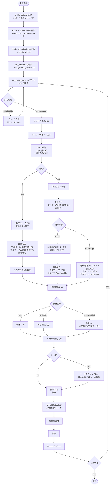

# もちふぃったープロファイル一覧

VRChat用アバターの「もちふぃったー」対応プロファイル情報をまとめた静的Webサイトと管理ツール群。

## 内容

### Webページ

- **index.html** - メインの一覧ページ（検索・フィルター機能付き）
- **lite.html** - 軽量版一覧ページ

### 管理ツール

- **profile_editor.py** - プロファイル編集GUI（フル機能版、BeautifulSoup4依存）
- **profile_editor_lower.py** - プロファイル編集GUI（軽量版、依存少）
- **booth_url_extractor.py** - Booth URLを抽出
- **diff_checker.py** - プロファイルの差分チェック
- **url_investigation.py** - URL調査ツール

### データ

- **data/profiles.json** - プロファイル情報（アバター名、作者、配布場所など）

## 登録作業フロー

## ライセンス

MIT License
