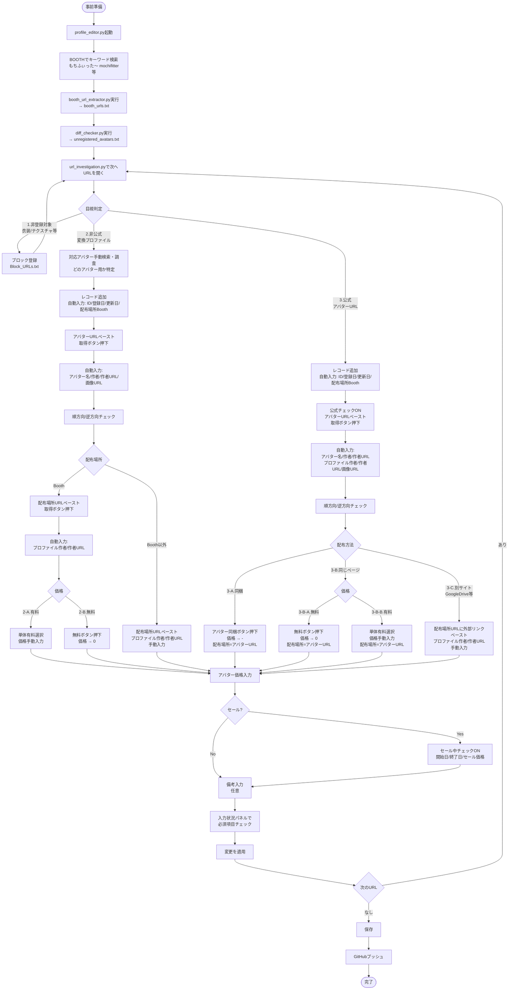

# もちふぃったープロファイル一覧

VRChat用アバターの「もちふぃったー」対応プロファイル情報をまとめた静的Webサイトと管理ツール群。

## 内容

### Webページ

- **index.html** - メインの一覧ページ（検索・フィルター機能付き）
- **lite.html** - 軽量版一覧ページ
- **terms.html** - 利用規約ページ

### 管理ツール

- **profile_editor.py** - プロファイル編集GUI
- **booth_url_extractor.py** - Booth URLを抽出
- **diff_checker.py** - プロファイルの差分チェック
- **url_investigation.py** - URL調査ツール
- **check_new_profiles.py** - 新規プロファイル自動チェック（GitHub Actions用）

### 開発ツール

- **scripts/server.py** - ローカル開発用HTTPサーバー
- **scripts/start_server.bat** - サーバー起動用バッチファイル（Windows）

### データ

- **data/profiles.json** - プロファイル情報（アバター名、作者、配布場所など）
- **data/Block_URLs.txt** - 除外するBooth商品URL（オプション）
- **data/Avatar_URLs.txt** - 除外するアバターURL（オプション）

## ローカル開発サーバー

Webページをローカル環境で確認するための簡易HTTPサーバーを用意しています。

### 起動方法

#### Windows（バッチファイル）

1. `scripts/start_server.bat` をダブルクリック
2. 自動的にブラウザが開き、サイトが表示されます
3. 終了するには、コンソールウィンドウで `Ctrl+C` を押してください

#### コマンドライン（全OS対応）

```bash
# 基本起動（ポート8000、ブラウザ自動オープン）
python scripts/server.py

# ポート番号を指定
python scripts/server.py --port 3000

# ブラウザを開かずに起動
python scripts/server.py --no-browser

# ヘルプを表示
python scripts/server.py --help
```

### アクセスURL

サーバー起動後、以下のURLでアクセスできます：

- メインページ: `http://localhost:8000/`
- 利用規約: `http://localhost:8000/terms.html`
- 軽量版: `http://localhost:8000/lite.html`

### 必要な環境

- Python 3.6以上（標準ライブラリのみ使用、追加パッケージ不要）

## 自動チェック機能

GitHub Actionsを使用して、Boothで新しいプロファイルを自動的にチェックします。

**詳しいセットアップ方法は [SETUP_GUIDE.md](SETUP_GUIDE.md) を参照してください。**

### 設定方法（概要）

1. **Discord Webhookの設定**
   - Discordでチャンネルの設定からWebhook URLを取得
   - GitHubリポジトリの Settings > Secrets and variables > Actions
   - `DISCORD_WEBHOOK_URL` という名前でシークレットを追加

2. **実行スケジュール**
   - 2時間ごとに自動実行
   - 手動実行も可能（Actions タブから「Check New Booth Profiles」を選択）

3. **チェック対象URL**
   - `https://booth.pm/ja/browse/3Dキャラクター?q=もちふぃった`
   - `https://booth.pm/ja/browse/3Dキャラクター?q=mochifitter`
   - `https://booth.pm/ja/browse/3Dモデル（その他）?q=もちふぃった`
   - `https://booth.pm/ja/browse/3Dモデル（その他）?q=mochifitter`
   - `https://booth.pm/ja/browse/3Dツール・システム?q=もちふぃった`
   - `https://booth.pm/ja/browse/3Dツール・システム?q=mochifitter`
   - `https://booth.pm/ja/browse/VRoid?q=もちふぃった`
   - `https://booth.pm/ja/browse/VRoid?q=mochifitter`

### 動作

1. 上記の検索URLから商品URLを収集
2. `profiles.json`、`Block_URLs.txt`、`Avatar_URLs.txt` と照合
3. 未登録の商品があれば：
   - Discord Webhookで通知
   - `unregistered_avatars.txt` をArtifactとして保存（30日間）
4. 未登録の商品がなければ正常終了

## 登録作業フロー



## ライセンス

MIT License
